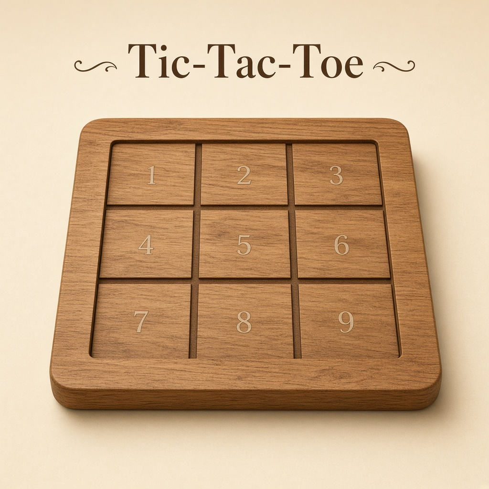

# Tic-Tac-Toe



A command-line Tic-Tac-Toe game written in Python. Play against a friend on the same computer, or against a computer opponent that uses the minimax algorithm.

## Requirements

- Python 3 (no extra packages)

## How to run

```bash
python Tictactoe.py
```

## Game modes

When the game starts, choose:

1. **Two players** — take turns as X and O on the same keyboard.
2. **Vs computer** — play against the computer. You can choose to be **X** (first) or **O** (second).

After a game ends, you can start another round or quit.

## How to play

The board is numbered **1–9**:

```
1 | 2 | 3
--+---+--
4 | 5 | 6
--+---+--
7 | 8 | 9
```

On your turn, enter the number of an empty square. Occupied squares are shown as `X` or `O`.

The first player to get three marks in a row (horizontal, vertical, or diagonal) wins. If the board fills with no winner, the game is a draw.

## Computer opponent

The computer always plays an optimal move using minimax. With perfect play, a game against the computer ends in a win for the computer or a draw.
